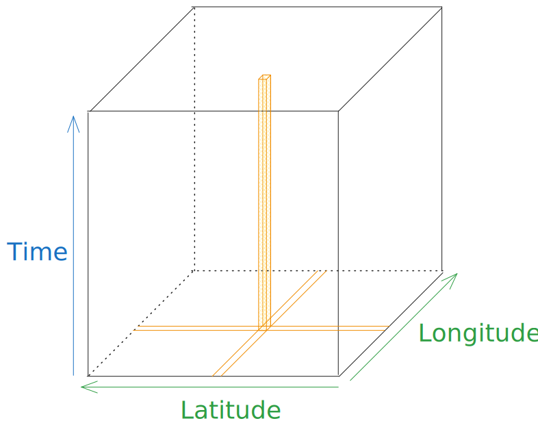
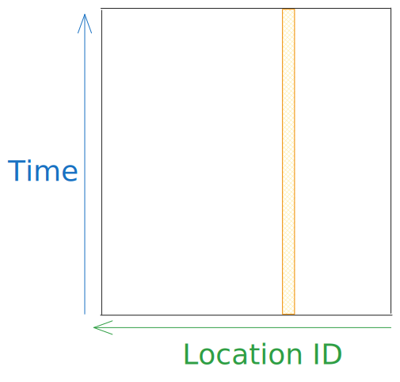
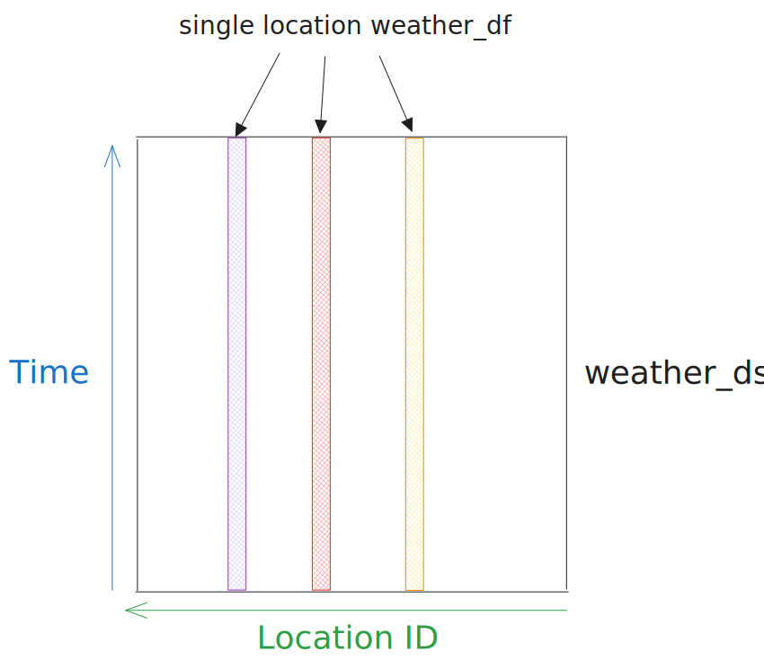
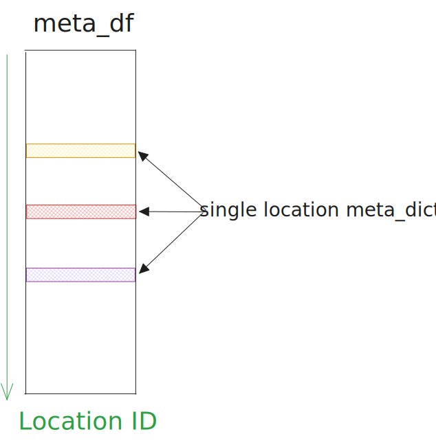
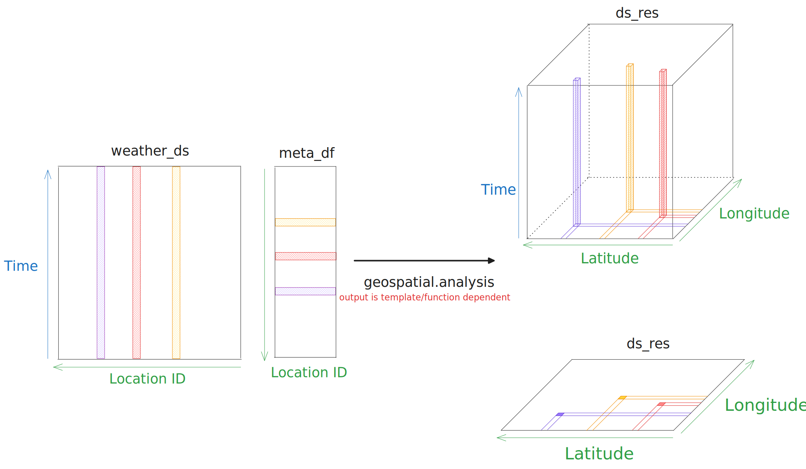
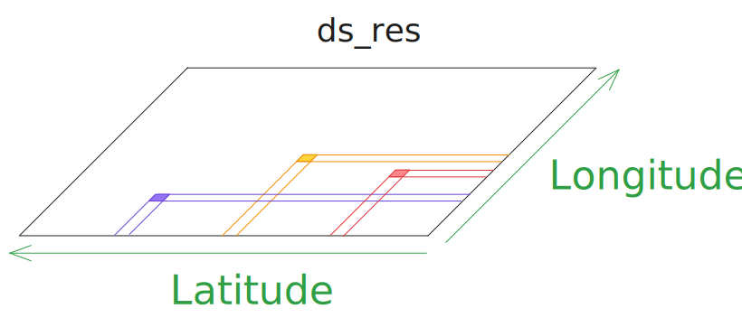
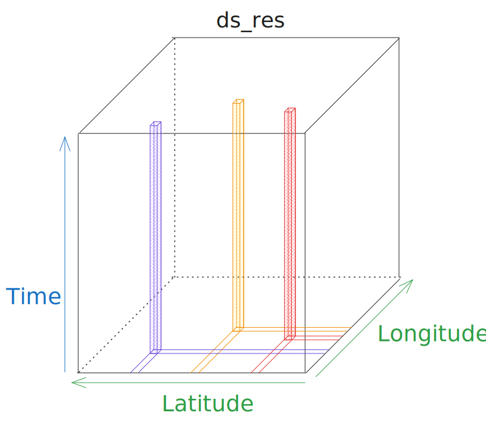

.. _geospatial:

Geospatial
==========

Geospatial data is time based data that maps to a location on Earth. PVDeg supports single site and geospatial analyses using meteorological and solar radiation data,
such as Typical meteorological year (TMY) data. This can be used to extrapolate the perfomance of PV systems over many years beacause it is statistically representative of 
weather conditions given a typical year. PVDeg collects an arbitrary amount of location specific meteorological and solar radiation data to run geospatial analyses.

These datasets are multidimensional, with time and location as coordinates. These data come from :ref:`NSRDB` and :ref:`PVGIS` and can commonly be expressed in two ways.

- three dimensions as a cube with coordinates ``time``, ``latitude``, and ``longitude``.
- two dimensions as a sheet with coordinates ``time``, and ``location id`` (often represented as gid). Gid is a geospatial id, these are problematic and largely meaningless, see :ref:`GIDS`.

*The orange 3d shape and 2d band represent a single location's data, in the corresponding representation. This can be weather and solar radiation or other calculated results.*

Geospatial Analysis
-------------------

To develop some intuition about what ``geospatial.analysis`` is doing lets examine the docstring. It says "applies a function to each gid of a weather dataset".
This is a very simple message but it is not clear how this works at a cursory look. This is a powerful paradigm. 

The most consequential part of the function is the mapping from the inputs to the output. The input and outputs are multi-dimensional and have a different number of dimensions.

*The specific function applied is not relevant at this point, it does change the data-variable results in the multi-dimensional output but this is a different aspect of the analysis function.*
This is explained in `Geospatial Templates`_

.. autofunction:: pvdeg.geospatial.analysis

Multi-dimensional inputs
^^^^^^^^^^^^^^^^^^^^^^^^
- ``weather_ds`` is an ``xarray.Dataset`` with coordinates/dimensions of ``time`` and ``gid``.
- ``meta_df`` is a ``pandas.DataFrame`` consisting of a row of data, extracting a single row yeilds a dictionary with metadata attributes for the specific location.

Looking at ``weather_ds``, we generally want to get one of the tall rectangles shown in the figure. To do this we only need to index by ``gid``. 
This will get a "slice" that contains all of the weather data for that location for the length of the dataset (usually 1 year). 
This slice is roughly equivalent to the weather ``pandas.DataFrame`` taken by ``pvdeg`` functions called ``weather_df``.

Looking at ``meta_df``, we want one of the wide rectangles shown in the figure. The dataframe is indexed by ``gid`` so we only need to index by a single ``gid``. 
This will get a "row" that contains the gid's meta data, such as latitude, longitude, time zone, and elevation/altitude.
This can be unpacked to the standard python dictionary (``dict``) taken by ``pvdeg`` functions called ``meta_dict``.

In this context, gids serve purely as indexes, gid a in ``weather_ds`` coresponds to index a in ``meta_df``. No other information can be reliabily derived from gids.

Multi-dimensional output
^^^^^^^^^^^^^^^^^^^^^^^^

- ``ds_res`` is a ``xarray.Dataset`` with coordinates/dimensions of ``time``, ``latitude``, and ``longitude`` or simply ``latitude`` and ``longitude`` as shown below. 

Notice, ``ds_res`` is a multi-dimensional result similar to the inputs but it's shape can vary. The two standard appearances of ``ds_res`` are shown stacked on the right side of the figure below.

The shape ``ds_res`` takes is determined by the provided function and template, ``func`` and ``template`` respectively. Oftentimes, ``template`` is not required because ``pvdeg`` 
can automatically generate simple templates for commonly used builtin functions. 

When a function returns a timeseries result then the result will look like the cube version of ``ds_res`` with a time axis shown below.
If the function returns single numeric results such as averages of a timeseries value then there is no need for a ``time`` axis. So the result will look like the plane version of ``ds_res`` shown below.
For more on this see `Geospatial Templates`_. 

.. _GeospatialTemplates:
Geospatial Templates
---------------------
Using multi-dimensional labeled arrays (``Xarray``) we are able to run calculations using meteorological data across many points at once. This process has been parallelized using `dask` and `xarray`. Both of these packages can be run locally or on cloud HPC environments. 

This presents a new issue, our models produce outputs in many different shapes and sizes. We can have single numerical results, multiple numeric results or a timeseries of numeric results at each location. To parallelize this process, we cannot wait until runtime to know what shape to store the outputs in. This is where the need for `templates` arises.

Previously, ``pvdeg.geospatial`` provided minimal templates and forced users to create their own for each function they wanted to use in a geospatial calculation. This is still an option via ``geospatial.output_template``.
But many pvdeg functions do not require a template for geospatial analysis.

Auto-templating: allows users to skip creating templates for most ``pvdeg`` functions. 
It is integrated into ``geospatial.analysis``. If a function is defined with the ``@decorators.geospatial_quick_shape`` decorator in the source code, we can call ``geospatial.analysis`` without providing a template.
The function responsible for this is called ``geospatial.auto_template`` and is exposed publicly to create templates outside of ``geospatial.analysis``.

If a function cannot be auto-templated, both ``geospatial.analysis`` and ``geospatial.auto_template`` will raise the following error.

.. code-block:: Python

    "<function name> cannot be autotemplated. create a template manually"

Auto-templating Example
-----------------------

The code below shows how to use auto-templating on a function implicitly. We simply call ``geospatial.analysis`` on a function that can be auto-templated and ``geospatial.analysis`` does the work for us.
Note: *we do not need to provide a template to "analysis" if the function can be auto-templated*

.. code-block:: Python

    geo_res = pvdeg.geospatial.analysis(
        weather_ds = geo_weather,
        meta_df = geo_meta,
        func = pvdeg.design.edge_seal_width,
    )

The code below shows the auto-templating process as the section above but this time we will explicitly call ``geospatial.auto_template`` and pass the generated template to ``geospatial.analysis``. 
The approach above is more direct and thus preferable.

.. code-block:: Python

    edge_seal_template = pvdeg.geospatial.auto_template(
        func=pvdeg.design.edge_seal_width,
        ds_gids=geo_weather
    )

    geo_res = pvdeg.geospatial.analysis(
        weather_ds = geo_weather,
        meta_df = geo_meta,
        func = pvdeg.design.edge_seal_width,
        template = edge_seal_template,
    )
 

Manual Templating Example I
---------------------

Creating manual templates is one of the most complicated parts of ``pvdeg``. We will use ``geospatial.output_template`` to tell ``pvdeg`` how to go from the multi-dimensional inputs to a multi-dimensional output.
We have do to this because the dimensions are chaning. Refer to the sketch in `Multi-dimensional output`_.

Lets examine some functions, comprehensive examples are the best way to illustrate this process.

We will start by creating templates for functions that support auto-templating. If you run the code below or use the auto-templating approches shown above, the result will be identical.

A simple function that has auto-templating is ``pvdeg.standards.standoff``. The docstring is shown below.

.. autofunction:: pvdeg.standards.standoff

We can see that this will return single numeric outputs for various aspects of standoff height calculation for each location. We want the output to rely only on the input location.
This is identified with an index, ``gid``. Since we have single numeric outputs, we do not want a time dimension. Borrowing from above, a simple sketch of the analysis output should look like the following.

The crux of this process is defining the shapes dictionary. As presented above, we only care about the ``gid`` axis on the input so the process for creating a template and running the analysis with it will be as follows.
The keys in the dictionary are named after the return values of the desired function. See the docstring for evidence of this. The values is a tuple of the dimensions that we map to in the output.

.. code-block:: Python

    shapes = {
        "x": ("gid",),
        "T98_inf": ("gid",),
        "T98_0": ("gid",),
    }

*Note: the tuples appear with a comma after the string, such that ("gid",) NOT ("gid"). This is because python will interpret the string as an group of characters to unpack if we do not
enforce the tuple requirement. Adding a comma forces python to interpret the parenthesis as a tuple*

Next, we will create a template using this shapes dictionary and the ``weather_ds``. The parameters may be misleadly named as ``ds_gids`` but this is the same as ``weather_ds`` in ``geospatial.analysis``.  

``geo_weather`` and ``geo_meta`` are placeholders for the geospatial weather and metadata that we would generally have in this scenario. It is not possible to generate an output template without providing the 
geospatial weather data beacause the function needs to know how many entries it needs to make along the ``gid`` axis in this case.

.. code-block:: Python

    standoff_template = pvdeg.geospatial.output_template(
        ds_gids=geo_weather, # geospatial xarray dataset 
        shapes=shapes, # output shapes defined above
    )

    geo_res = pvdeg.geospatial.analysis(
        weather_ds = geo_weather, # geospatial xarray dataset
        meta_df = geo_meta, # geospatial metadata dataframe
        func = pvdeg.standards.standoff,
        template = standoff_template # template created in this example
    )

Manual Templating Example II
-----------------------------
Another function we can look at that supports auto-templating is ``pvdeg.humidity.module``. This calculates module humidity parameters over a timeseries. This is where we diverge from the previous example.
Inspect the docstring below and look at the return types, notice this will be a timeseries result.

.. autofunction:: pvdeg.humidity.module

Now we will define the shapes dictionary, the output will be a mapping from the input dimensions of ``gid`` and ``time`` so both of these will appear in our ``shapes`` value tuples. 
Thus our output will have a time axis and show look like the ``ds_res`` as a cube with the time axis as shown below. 

This is an oversimplification but each column in the cube represets a ``pandas.DataFrame`` result with columns represeting each return value and a ``pd.DatetimeIndex``. The columns will be named as follows.

- "RH_surface_outside"
- "RH_front_encap"
- "RH_back_encap"
- "RH_backsheet"

The docstring does not give us that much useful information about the results so we can run it on a single location and get the column names or dict keys then these will become our shape names.
This is not ideal but simply running at a single site before a geospatial calculation can yield useful context. ``geospatial.analysis`` error messages are oftentimes clear. 
This is a result of dask, lazy-computing and confusing higher dimensional datasets.

.. code-block:: Python

    shapes = {
        "RH_surface_outside": ("gid", "time"),
        "RH_front_encap": ("gid", "time"),
        "RH_back_encap": ("gid", "time"),
        "RH_backsheet": ("gid", "time"),
    }

This shapes dictionary is valid, so we can pass it to ``geospatial.output_template`` as in the above example and run the analysis.

.. code-block:: Python

    module_humidity_template = pvdeg.geospatial.output_template(
        ds_gids=geo_weather, # geospatial xarray dataset 
        shapes=shapes, # output shapes defined above
    )

    geo_res = pvdeg.geospatial.analysis(
        weather_ds = geo_weather, # geospatial xarray dataset
        meta_df = geo_meta, # geospatial metadata dataframe
        func = pvdeg.module.humidity,
        template =  module_humidity_template # template created in this example
    )

Manual Templating Example III
-----------------------------
Last, lets look at another example. This one will be abridged as it covers the same topic as `Manual Templating Example II`_.

This time consider ``pvdeg.letid.calc_letid_outdoors``. Lets inspect the docstring to see what the return values look like.

.. autofunction:: pvdeg.letid.calc_letid_outdoors

Once again we can see that the output shapes are obscured. It just says we are returning a ``pandas.DataFrame`` called timesteps. This is not helpful.
We will have to run the function at a single location to see what the column names are. 

Assuming we ran ``pvdeg.letid.calc_letid_outdoors`` at a single site we would see that the DataFrame columns are named as follows.

- "Temperature"
- "Injection"
- "NA"
- "NB"
- "NC"
- "tau"
- "Jsc"
- "Voc"
- "Isc"
- "FF"
- "Pmp"
- "Pmp_norm"

Because we know the function returns a ``pandas.DataFrame`` with a time index, all of the columns will have entries at each timestep. This means that we need to include, the ``time`` dimension in our output.
The shapes dictionary will look like the following. For visual assistance, refer to the cube shaped ``ds_res`` sketch.

.. code-block:: Python

    shapes = {
        "Temperature": ("gid", "time"),
        "Injection": ("gid", "time"),
        "NA": ("gid", "time"),
        "NB": ("gid", "time"),
        "NC": ("gid", "time"),
        "tau": ("gid", "time"),
        "Jsc": ("gid", "time"),
        "Voc": ("gid", "time"),
        "Isc": ("gid", "time"),
        "FF": ("gid", "time"),
        "Pmp": ("gid", "time"),
        "Pmp_norm": ("gid", "time"),
    }

Now we have defined shapes, as above we can simply pass it to ``geospatial.output_template`` and use the generated template in our analysis.

.. code-block:: Python

    letid_template = pvdeg.geospatial.output_template(
        ds_gids=geo_weather, # geospatial xarray dataset 
        shapes=shapes, # output shapes defined above
    )

    geo_res = pvdeg.geospatial.analysis(
        weather_ds = geo_weather, # geospatial xarray dataset
        meta_df = geo_meta, # geospatial metadata dataframe
        func = pvdeg.letid.calc_letid_outdoors
        template =  letid_template # template created in this example
    )