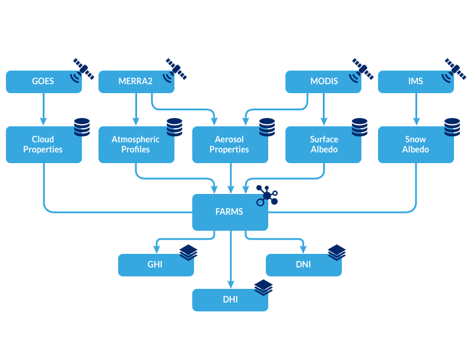
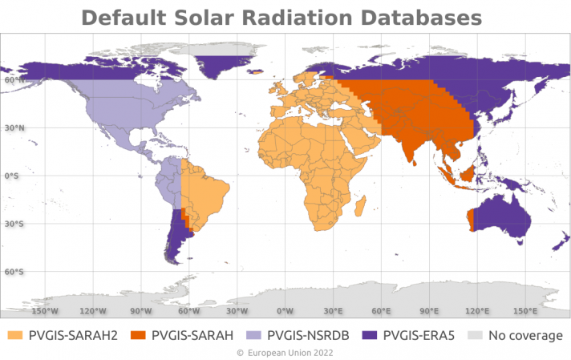

.. _meteorological-data.rst:

Meterological Data
==================

PVDeg seeks to automate the tedious parts of degradation analysis by providing simple tools to work with weather data. 
``pvdeg.weather.get`` seeks to unify this functionality into a simple function.

The PVDeg tutorials and examples use two datasets, `NSRDB`_ and `PVGIS`_. These are serially complete data including meteorological data and solar radiation (irradiance) measurements.
The methodology for these datasets varies but both are gridded geospatial datasets with similar attributes.

.. _NSRDB:
NSRDB 
------
The NSRDB is produced by NREL and combines multiple datasets but we are most concerned with `Physical Solar Model 3 (PSM3) <https://developer.nrel.gov/docs/solar/nsrdb/psm3-2-2-download/>`_. This data was generated using satellite data from multiple channels to derive cloud 
and aerosol properties, then fed into a radiative transfer model. Learn more about the NSRDB `here <https://nsrdb.nrel.gov/about/what-is-the-nsrdb#:~:text=The%20PSM%20is%20a%20two-step%20physical%20modeling%20process%2C,%28Xie%20et%20al.%2C%202016%29%2C%20in%20the%20subsequent%20step.>`_. 

The NSRDB is free to use but requires an api-key and email. See :ref:`NSRDB_API_Key` for more information. 
For our purposes, the api is limited to 1000 requests per day, although you can request a batch download via email with a singificantly higher rate limit (not recommended for PVDeg).

Flowchart showing the dataflow from satellite to solar radiation measurement.

`<https://nsrdb.nrel.gov/about/what-is-the-nsrdb>`_

NSRDB data are seperated by satellite/model source. Each dataset is shown below, much of the PVDeg project uses the *Americas* data.

.. image::  meteorological-data-details/nsrdb_global_coverage.jpg
    :alt: NSRDB data sources, image missing

`<https://nsrdb.nrel.gov/about/what-is-the-nsrdb>`_

.. _PVGIS:
PVGIS
------
`PVGIS`_ is the European counterpart of the `NSRDB`_. The data was sourced similarly. With PVGIS we are most concerned with a `typical meteorological year <https://joint-research-centre.ec.europa.eu/photovoltaic-geographical-information-system-pvgis/pvgis-tools/pvgis-typical-meteorological-year-tmy-generator_en>`_.
PVDeg uses utilities built in `pvlib <https://pvlib-python.readthedocs.io/en/stable/index.html>`_ to access the data.

PVGIS is free to use and does NOT require an api-key. It has a rate limit of 30 requests per second and covers a much larger range of longitudes and latitudes.

The PVDeg tutorials and examples use two datasets, `NSRDB`_ and `PVGIS`_. These are serially complete data including meteorological data and solar radiation (irradiance) measurements.
The methodology for these datasets varies but both are gridded geospatial datasets with similar attributes.

PVGIS data are seperated by satellite/model source. Each satellite source for PVGIS 5.2 is shown below.

`<https://joint-research-centre.ec.europa.eu/photovoltaic-geographical-information-system-pvgis/pvgis-releases/pvgis-52_en>`_

Sources for PVGIS 5.3

.. image::  meteorological-data-details/pvgis-53.png
    :alt: PVGIS 5.3 satellite sources, image missing

`<https://joint-research-centre.ec.europa.eu/photovoltaic-geographical-information-system-pvgis/pvgis-releases/pvgis-53_en>`_ 

.. _GIDS:
Issues with Gids
----------------

"Gids", plural or "gid" singular refer to a geospatial id. This is where the simplicity ends because gids are largely meaningless.

When using ``pvdeg.weather.get`` to grab PVGIS data as follows. We will get a gid back but it will always be the same because PVGIS gids are meaningless. The gids created during this process only serve as indexes.

.. code-block:: Python

    weather_df, meta_df = pvdeg.weather.get(
        database="PVGIS",
        id = (<lat>, <lon>),
    )

When using the NSRDB PSM3 dataset, gids are unique only to their satellite. Because of this, gids can only be treated as unique if we can guarantee only one satellite source is being utilized. 
This is possible but causes headaches.

.. code-block:: Python

    weather_df, meta_df = pvdeg.weather.get(
        database="PSM3",
        id = (<lat>, <lon>),
        email = <myemail>,
        api_key = <api_key>,
    )

Takeaway: gids are not unique or necessarily meaningful, be careful when using them. Duplicate gids can exist in geospatial data and will be loaded using Xarray without raising an error.