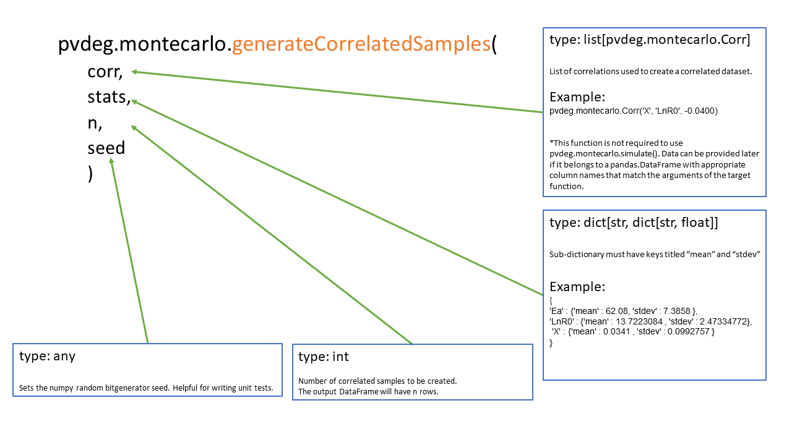
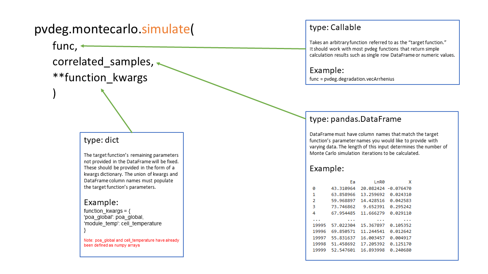
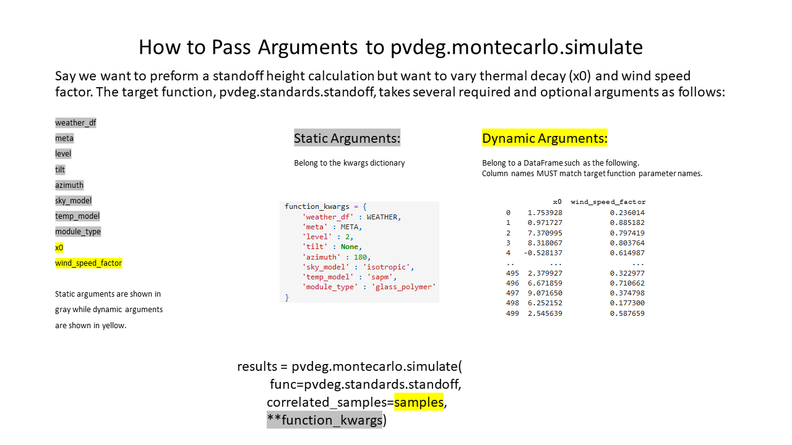

.. _montecarlo:

Monte Carlo
===========

Monte Carlo simulations are a mathematical technique used to predict possible outcomes on an uncertain event. Pvdeg uses pv modeling constants as variables to preform Monte Carlo simulations. These parameters include but are not limited to R_0	Frequency factor, prefactor, 

*Add non-exhaustive list of possible monte carlo variables*

See the PVdeg Monte Carlo tutorials for specific case details
*here (insert later)*

General Steps
-------------

Defining Correlations
^^^^^^^^^^^^^^^^^^^^^
If your variables are correlated form a list of correlations using pvdeg.montecarlo.Corr() objects.  
``my_correlations = [pvdeg.montecarlo.corr('<var_1>', '<var_2>', <float>), ...]``

Defining Mean and Standard Deviation
^^^^^^^^^^^^^^^^^^^^^^^^^^^^^^^^^^^^
Each variable passed to a Corr object in string form must have its own dictionary entry containing its mean and standard deviation in the following form.

.. code-block:: Python

    my_dict = {
    <var_1> : {'mean' : <float>, 'stdev' : <float>}
    }

Generating Correlated Samples
^^^^^^^^^^^^^^^^^^^^^^^^^^^^^
``pvdeg.montecarlo.generateCorrelatedSamples()`` can be used to create correlated samples for our monte carlo simulation. The image below shows how to provide its arguments in detail. *Note: seed is an optional argument.*  

Generating Uncorrelated Samples
^^^^^^^^^^^^^^^^^^^^^^^^^^^^^^^
To create uncorrelated samples the ``corr`` parameter of ``pvdeg.montecarlo.generateCorrelatedSamples()`` provided with an empty list, while still providing the other arguments. like the following.  

.. code-block:: Python

    pvdeg.montecarlo.generateCorrelatedSamples(
        corr = [], 
        ...
        ...
    )

3rd Party Samples/Data
^^^^^^^^^^^^^^^^^^^^^^
If you have another prefered way of creating samples to use in a Monte Carlo simulation you can bypass the previous steps. The samples DataFrame must have appropriate column names that match the target function's arguments.  

Running A Monte Carlo Simulation
--------------------------------
Use ``pvdeg.montecarlo.simulate()`` to run a Monte Carlo simulation on a target function. See the image below for more detail.

Selecting Static and Dynamic Variables
--------------------------------------
See the image below which shows how to split your Monte Carlo inputs into the appropriate function arguments.

