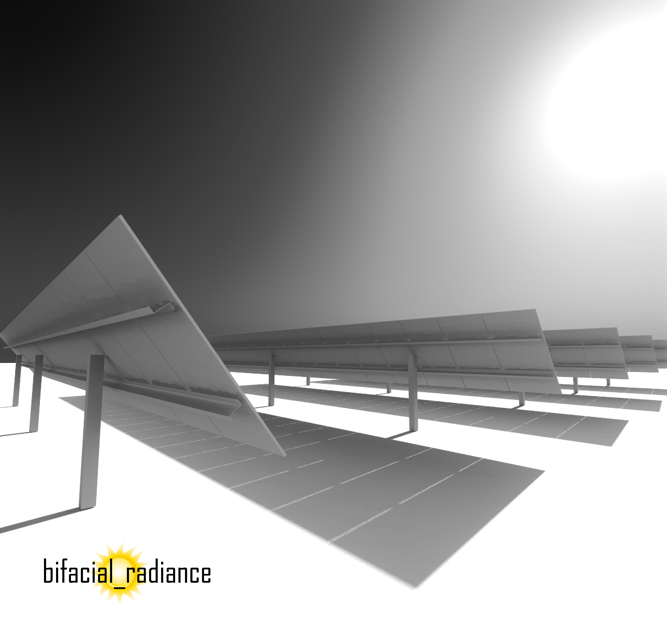

# Summary

[comment]: Brief Intro
PVDegradationTools, or PVDeg for short, is a national-laboratory-developed, community-supported, open-source toolkit that provides a set of functions and classes for simulating the degradation of photovoltaic (PV) systems. PVDeg automates calculations of PV system degradation and performance. Specific algorithms include .... , among others. PVDeg is an important component of a growing ecosystem of open-source tools for solar energy [@Holmgren2018].

[comment]: Image of PVDeg results or something?
{ width=80% }

[comment]: Hosting and documentation
PVDeg is hosted on Github and PyPi, and it was developed by contributors from national laboratories, academia, and private industry. PVDeg is copyrighted by the Alliance for Sustainable Energy with a BSD 3-clause license allowing permissive use with attribution. PVDeg is extensively tested for functional and algorithm consistency. Continuous integration services check each pull request on Linux and Python versions 2.7 and 3.6. PVDeg is thoroughly documented, and detailed tutorials are provided for many features. The documentation includes help for installation and guidelines for contributions. The documentation is hosted at readthedocs.org. Github’s issue trackers provide venues for user discussions and help.

[comment]: Introducing the 3 parts: classes/functions, the library, and the
geospatial
The PVDeg python library is a spatio-temporal modeling assessment tool
that empowers users to calculate various PV degradation modes, for different
PV technologies and materials. It is designed to serve the PV
community, including researchers, device manufacturers, and other PV
stakeholders to assess different degradation modes in locations around the
world. The library is developed and hosted open-source on GitHub, and is
structured in three layers: core functions and classes, scenario analysis class,
and geospatial analysis. These algorithms are typically implementations of models
published in the existing peer-reviewed literature. In addition, data for
PVDeg is sourced from the National Solar Radiation Database and the (NSRDB)
and Photovoltaic Geographcial Information System (PVGIS). PVDeg also contains
its own internal database of material and degradation parameters. The core API
consists of functions and classes that provide specialized calculations for
individual degradation mechanisms, material properties, and environmental
modeling. Examples include `pvdeg.humidity.module()` for moisture ingress
modeling, and pvdeg.letid.calc_letid_outdoors()` for light and elevated temperature
induced degradation. The scenario analysis class layer wraps the core API
functions into user-friendly workflows, simplifying the setup and execution of
complex multi-parameter degradation studies. This layer provides an intuitive
interface for multiple analysis components, with practical implementation
examples in a series of Jupyter notebook tutorials. Users can create `Scenario`
objects to define locations, modules, and analysis pipelines, then execute
multiple degradation calculations simultaneously across different module
configurations and extract results for comparative analysis. Finally, the
geospatial analysis layer enables large-scale spatial analyses by automatically
distributing degradation calculations across geographic regions using parallel
processing and advanced data structures. This layer supports studies such as mapping
standoff distances across the United States, analyzing LETID degradation patterns across
climate zones, and identifying optimal locations for specific PV technologies. The
geospatial layer includes specialized visualization functions for mapping results and
supports both uniform and stochastic spatial sampling strategies to balance
computational efficiency with geographic coverage.

[comment]: Release Info
Holsapple, Derek, Ayala Pelaez, Silvana, Kempe, Michael. "PV Degradation Tools", NREL Github 2020, Software Record SWR-20-71.

PVDeg was first coded in Python and released as a stable version in Github after submission to the a U.S. Department of Energy Code project on 2020 [@Holsapple]. Expansions for geospatial and monte carlo framework were undertaken in 2024 [@REF]. Additional features continue to be added as described in @REF, and in the documentation’s “What’s New” section.

[comment]: LITERATURE USES  -- Mike kempe's standard, paper, pvdeg papers showcasin use, duramat webinars... agrivoltaics publication, stalled tracker analysis
PVDeg has been used in numerous studies, for example, in [@ ], for calculating effective standoff distances across the US following IEC 63126 for thermal stability, as well as on the standard itself, IEC TS 63126, for providing user-friendly maps for calculating these standoff distances for any worldwide location. [@IEC TS 6t3126]. It has also been used for studying the senstivity of diffuse-tracing methodologies geospatially to time reponse and weather, modeling the yearly performance and tracker movement change under smart tracking algorithms  in [@Adinolfi2024] and [@Adinolfi2025]. It's most recent use is also on the implementation of geospatial modeling of pySAM simulatins for claculation of ground-irradiance for dual-use agrivoltaics [@PVSC 2023], wiht pending dataset publication. an example of geospatial and geo-temporal results can also be seen in [@Karas] study of the LeTID process phenomenon, where users can observe the output of module degradaiton and improvement over a period of various years to these recently discovered and parameterized degradation.

[comment]: More detail in geospatial and monte carlo usefulness?
Perhaps the most power and area of focus in the PVDeg result, taht has warranted its uptake in the PV Reliability communiyt, are both the geospatial and monte carlo features. 
Furthermore, benchmarking with other rear-irradiance calculation software has been performed on several occasions [@Ayala2018b; @DiOrio2018; @Capelle2019]. Rear-irradiance calculation software fall into two categories: view-factor and ray-tracing models. View factor models assume isotropic scattering of reflected rays, allowing for calculation of irradiance by integration [@Marion2017]. Due-diligence software such as PVSyst or SAM use the view-factor model [@PVSyst; @SAM]. There are also some open-source view-factor models, such as bifacialvf, and PVFactors [@bifacialvf; @PVfactors]. Ray-tracing models simulate multipath reflection and absorption of individual rays entering a scene. Raytracing software such as bifacial_radiance, which is the only available open-source toolkit, offers the possibility of reproducing complex scenes, including shading or finite-system edge effects. Model agreement for view factor and bifacial_radiance software is better than 2\% (absolute) when compared with measured results. [@Ayala2018b]. 

[comment]: Plans
Plans for bifacial_radiance development include the implementation of new and existing models, addition of functionality to assist with input/output, and improvements to API consistency.

# Acknowledgements

The authors acknowledge and thank the code, documentation, and discussion contributors to the project.

S.A.P. and C.D. acknowledge support from the U.S. Department of Energy’s Solar Energy Technologies Office. This work was authored, in part, by the National Renewable Energy Laboratory, operated by Alliance for Sustainable Energy, LLC, for the U.S. Department of Energy (DOE) under Contract No. DE-AC36-08GO28308. Funding was provided by the U.S. Department of Energy’s Office of Energy Efficiency and Renewable Energy (EERE) under Solar Energy Technologies Office Agreement Number 34910.

The National Renewable Energy Laboratory is a national laboratory of the U.S. Department of Energy, Office of Energy Efficiency and Renewable Energy, operated by the Alliance for Sustainable Energy, LLC.

# References